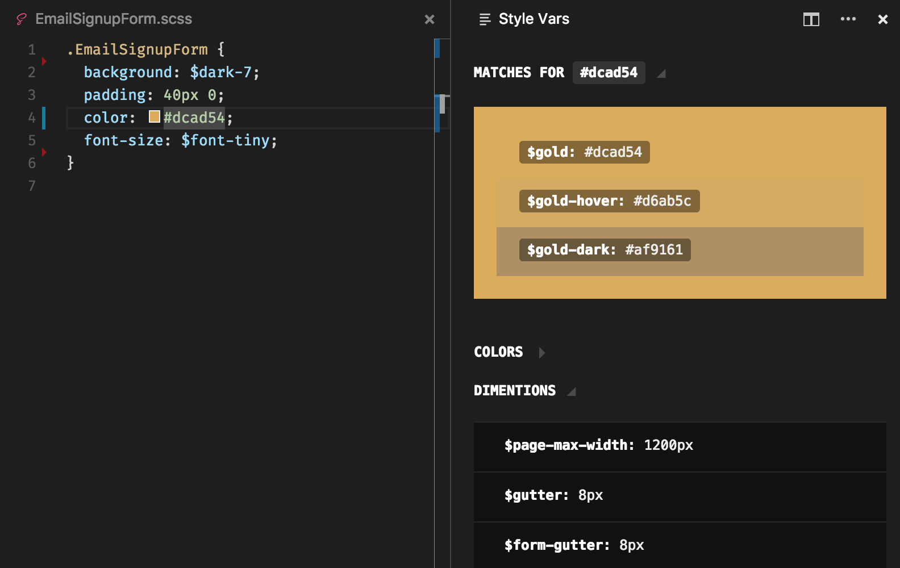

Access your style variables from a side panel (CSS, SASS, LESS, PostCSS...)



### Variables matching

If you use SASS, LESS, PostCSS or any CSS prepocessor, you probably use variables to set colors, font sizes, dimentions...
And if you integrate your UI from images provided by your design team, you probably try to match the colors from the design with your existing variables. This process is not fun and it's temptating to use a color picker and just paste static values.

The good new is that if you do take this lazy route, it's ok! The style vars side panel will read the value at your cursor position and display your best matching variables. Click on the one you want to insert and youre done!

It makes it also supper easy to update your existing code to use more variables.

### How to use it:

To open the panel, run this vscode command: `> Show style vars panel`

Right now this extention is not able to gather the available variables accros your project. So you have to provide the list yourself:

File: `.vscode/style-vars.json`

```js
{
  "$red": "#f00",
  "$my-font": "Times, serif"
  // ...
}
```
> Those variables will be automatically sorted and categorized (color, dimention, other...)

If you are using SCSS, you can generate this file easily with extract-sass-vars:

`npm i -g extract-sass-vars`
`extract-sass-vars yourVariablesFile.scss > .vscode/style-vars.json`

To keep it up to date, add a postinstall script in your package.json ;)

### PRs are welcome!
